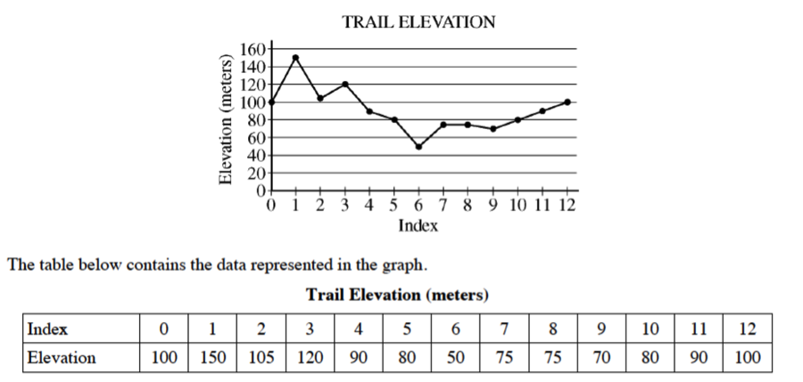

.. qnum::
   :prefix: 2-3-
   :start: 1
   
.. |runbutton| image:: Figures/run-button.png
    :height: 20px
    :align: top
    :alt: run button   
    
.. |pass| image:: Figures/pass.png
    :height: 20px
    :align: top
    :alt: pass
    
.. |fail| image:: Figures/fail.png
    :height: 20px
    :align: top
    :alt: fail
    
.. |start| image:: Figures/start.png
    :height: 24px
    :align: top
    :alt: start
    
.. |checkme| image:: Figures/checkMe.png
    :height: 20px
    :align: top
    :alt: check me
    
.. |finish| image:: Figures/finishExam.png
    :height: 24px
    :align: top
    :alt: finishExam
    
.. |right| image:: Figures/rightArrow.png
    :height: 24px
    :align: top
    :alt: right arrow for next page
            

Pretest Order Code Problem
----------------------------

Construct the function ``isLevel(elList, start, end)``, which returns ``True`` when the trail segment is level and ``False`` otherwise.
A trail segment is defined by a starting marker, an ending marker, and all markers between those two markers (including the start and end markers). The parameters of the method are the list of elevations at the markers, the index
of the starting marker, and the index of the ending marker. 

The method should return true if the difference
between the maximum elevation and the minimum elevation in the trail segment is less than or equal to
10 meters. 

Examples
============

For the trail shown in Figure 1 below, the trail segment starting at marker 7 and ending at marker 9 has elevations ranging from 70 to 75 meters.  Because the difference between 75 and 70 is less than 10 it is considered level.  The trail segment starting at marker 7 and ending at
marker 10 has elevations ranging between 70 and 80 meters. Because the difference between 80 and 70 is
equal to 10, the trail segment is also considered level.
The trail segment starting at marker 7 and ending at marker 11 has elevations ranging between 70 and
90 meters. Because the difference between 90 and 70 is greater than 10, this trail segment is not considered level.

    Figure 1: The trail elevation as a graph and as a table

See the table below for a summary of the examples above.  

======= ===== =======  ====== ================  ===========
 Start   End    Max     Min   Difference <= 10   is Level?
======= ===== =======  ====== ================  ===========
   7      9      75      70          5			  True
   7     10      80      70         10            True
   7     11      70      90         20            False
======= ===== =======  ====== ================  ===========

Order Code Here
================

Click on the |start| button below when you are ready to try to order this code.  You will have up to 10 minutes to try to solve it.  Click on the |checkme| button to check your solution.  Click on the |finish| button when you have solved this problem or wish to move on without solving it.

.. timed:: pretest_is_level_timed
   :timelimit: 10
   :noresult:
   :nofeedback:
   :fullwidth:
   
   .. parsonsprob:: Pretest_Order_Is_Level
      :order: 8,0,13,4,10,7,1,5,12,9,2,11,3,6
   
      The code below is mixed up and contains extra blocks that are not needed.  Drag the needed code from the left to the right and put them in order with the correct indention so that the code would work correctly.  
      -----
      def isLevel(elList, start, end):
      =====
          max = elList[start]
      =====
          max = elList[0] #distractor
      =====
      	  min = max
      =====
          for index in range(start,end+1):
      =====
          for index in range(start,end): #distractor
      =====
      	      value = elList[index]
              if value > max: 
      =====
                  max = value
      =====
                  value = max #distractor
      =====
              if value < min:
      =====        
              if min < value: #distractor
      =====
                  min = value
      =====
          return (max - min) <= 10
      =====
          return (max - min) >= 10 #distractor
          
When you are finished with this problem, or are ready to move on, click the |finish| button and then go to the next page by clicking the right arrow |right| near the bottom right of this page.    
