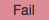

.. qnum::
   :prefix: 2-4-
   :start: 1

.. |runbutton| image:: Figures/run-button.png
    :height: 20px
    :align: top
    :alt: run button
   
.. |pass| image:: Figures/pass.png
    :height: 20px
    :align: top
    :alt: pass
    

    
.. |checkme| image:: Figures/checkMe.png
    :height: 20px
    :align: top
    :alt: check me
    
.. |start| image:: Figures/start.png
    :height: 24px
    :align: top
    :alt: start
    
.. |finish| image:: Figures/finishExam.png
    :height: 24px
    :align: top
    :alt: finishExam
    
.. |right| image:: Figures/rightArrow.png
    :height: 24px
    :align: top
    :alt: right arrow for next page

               
Pretest Write Code Problem
----------------------------
    
Finish writing the function ``getAverageRainfall`` that takes a list that contains the amount of rainfall for each day, collected by a meteorologist. Her rain gathering equipment occasionally makes a mistake and reports a negative amount for that day.  Calculate the total rainfall by adding up all the non-negative values (including 0), also count the number of non-negative values, and return the average rainfall at the end.  Only return the average if there was at least one non-negative integer in the list, otherwise return 0.

Examples
=========

For example ``getAverageRainfall([1, 2, -3, 3])`` should ignore the -3 and sum (1 + 2 + 3) which is 6 and then divide 6 by 3 (the number of values used in the sum) to return 2.  Also, the function ``getAverageRainfall([-1, -2, -1, -3])`` should return 0 since there are no non-negative numbers in the list.

Write Code Here
=================

Finish writing the function so that the hidden tests all print |pass| when you click the |runbutton| button. The error messages and test results are displayed below the code. 
               
Click on the |start| button below when you are ready to try to write this code.  You will have up to 10 minutes to try to write it.  Click on the |runbutton| button to run and test the code.  Click on the |finish| button when you have solved this problem or wish to move on without solving it.

.. timed:: pretest_rainfall_write_timed
   :timelimit: 10
   :noresult:
   :nofeedback:
   :fullwidth:
    
   .. activecode:: Pretest_Rainfall_Write
   
      # Write the getAverageRainfall function below
      # It should sum all the non-negative values in 
      # the list rain and return the average which is 
      # the sum divided by the count of non-negative values
      # if there are no non-negative values it should 
      # return 0
      def getAverageRainfall(rain):

      
          
      ====
          
      # code to test the getAverageRainfall function        
      from unittest.gui import TestCaseGui
      
      class myTests(TestCaseGui):

          def testTarget(self):
              self.assertEqual(getAverageRainfall([1, 2, -3, 3]), 2, "Test of getAverageRainfall([1, 2, -3, 3])")
              self.assertEqual(getAverageRainfall([-1, 2, 1, 3]), 2, "Test of getAverageRainfall([-1, 2, 1, 3])")
              self.assertEqual(getAverageRainfall([-1, -2, -1, -3]), 0, "Test of getAverageRainfall([-1, -2, -1, -3])")
              self.assertEqual(getAverageRainfall([-1, -2, 17, 13]), 15, "Test of getAverageRainfall([-1, -2, 17, 13])")
              self.assertEqual(getAverageRainfall([-1, 3, 17, 13, -2, 7]), 10, "Test of getAverageRainfall([-1, 3, 17, 13, -2, 7])")
		   
      myTests().main()

When you are finished with this problem, or are ready to move on, click the |finish| button and then go to the next page by clicking the right arrow |right| near the bottom right of this page.    
